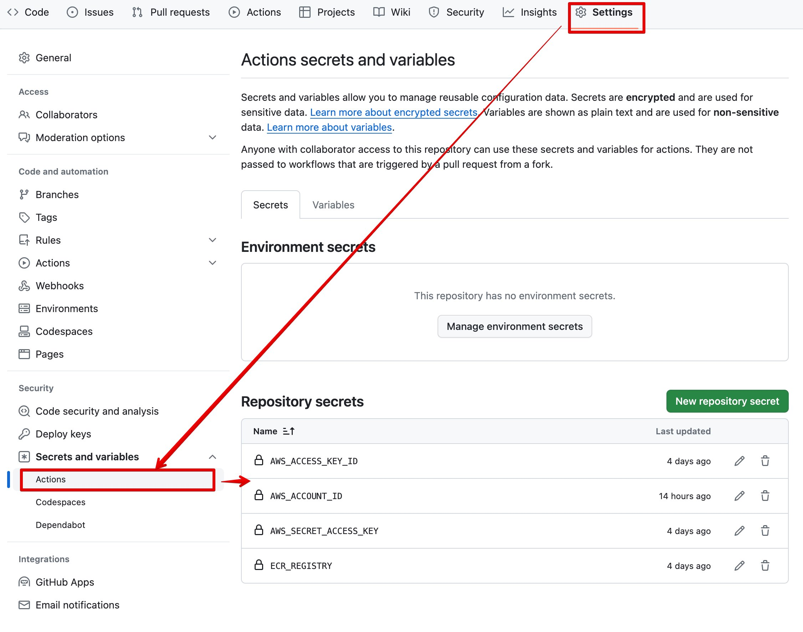
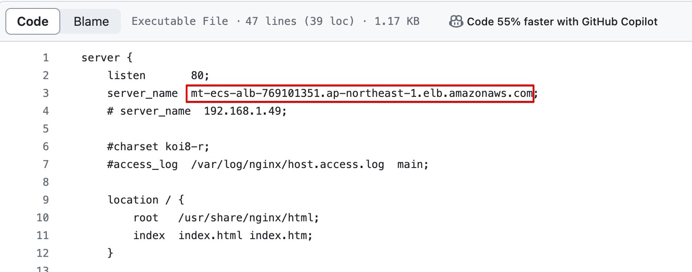
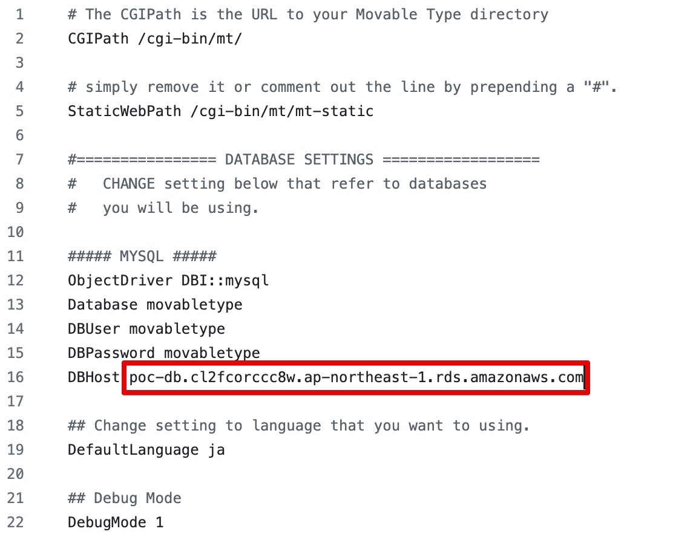

# 1. ECSでMovableTypeを動かす

- [1. ECSでMovableTypeを動かす](#1-ecsでmovabletypeを動かす)
  - [1.1. このリポジトリは？](#11-このリポジトリは)
  - [1.2. 構成概要](#12-構成概要)
  - [1.3. 手順](#13-手順)
    - [1.3.1. 手順概要](#131-手順概要)
    - [1.3.2. AWSリソースの構築](#132-awsリソースの構築)
    - [1.3.3. GitHubActionsの事前準備](#133-githubactionsの事前準備)
    - [1.3.4. default.confの書き換え](#134-defaultconfの書き換え)
    - [1.3.5. mt-config.cgiの書き換え](#135-mt-configcgiの書き換え)
    - [1.3.6. GitHubへのPUSH](#136-githubへのpush)
    - [1.3.7. 動作確認](#137-動作確認)
  - [1.4. 参考](#14-参考)
    - [1.4.1. ECSで動作するDockerImageの作成手順](#141-ecsで動作するdockerimageの作成手順)
    - [1.4.2. 動作確認で使用したツール](#142-動作確認で使用したツール)
      - [1.4.2.1. Docker](#1421-docker)
      - [1.4.2.2. Terraform](#1422-terraform)


## 1.1. このリポジトリは？

ECSでMovableTypeで動作するかの検証をするためのリポジトリです。

この```README.md```はその手順を示しています。

## 1.2. 構成概要

MovableTypeはECS、データベースはRDS（mysql）で実装しています。

可能な限りコードで管理し、手数を少なく動作するように心がけています。

## 1.3. 手順

リクエストいただいた、以下の手順を示します。

- ECSで動作するDockerImageの作成手順
- DockerImageをECSで動かす手順

なお、Git等の基本的な操作は前提スキルとして、ここでの説明は割愛します。また、terraformが動作する環境が整っていることを前提としています。

### 1.3.1. 手順概要

大きく以下の順番で構築します。

- terraformでAWSのリソースを構築する
- GitHubActionsでMovableTypeをデプロイする（DockerイメージのビルドからECSタスクへのデプロイまで実施）

### 1.3.2. AWSリソースの構築

infraディレクトリにterraformのファイル群を格納しています。以下のコマンドによりterraformでAWSのリソースを構築します。リージョンは東京を使用します。

初期化

```
terraform init
```

適用計画

```
terraform plan
```

適用

```
terraform apply --auto-approve
```

適用後にALBのDNS名、DBのエンドポイント、ECRのリポジトリURLが表示されます。後続の作業でコード書き換えやGitHubActionsの設定に使用するためメモします。

```
（例）
ALB_DNS_NAME = "mt-ecs-alb-697782372.ap-northeast-1.elb.amazonaws.com"
db_host = "poc-db.cl2fcorccc8w.ap-northeast-1.rds.amazonaws.com:3306"
repository_url = "999999999.dkr.ecr.ap-northeast-1.amazonaws.com/docker-mt-lamp-web"
```

### 1.3.3. GitHubActionsの事前準備

GitHubのリポジトリから、SECRETSを設定します。



SECRETSは以下を登録します。

- AWS_ACCESS_KEY_ID・・・アクセスキー
- AWS_SECRET_ACCESS_KEY・・・シークレットアクセスキー
- ECR_REGISTRY・・・ECRのリポジトリ(上の手順でメモったrepository_url。例：```999999999.dkr.ecr.ap-northeast-1.amazonaws.com```　「/docker-mt-lamp-web」は不要) 
- AWS_ACCOUNT_ID・・・ご自身のAWSアカウントID 
  


### 1.3.4. default.confの書き換え

[default.conf](default.conf)の```server_name```を上でメモしたALBのDNS名に書き換えます。



### 1.3.5. mt-config.cgiの書き換え

[mt-config.cgi](mt-config.cgi)のDBHostを上でメモしたdb_hostに書き換えます。（ポート番号は不要です）



### 1.3.6. GitHubへのPUSH

ファイルを書き換えた後、GitHubにPUSHします。

mainへのPUSHをきっかけに、GitHubActionsが動き、MovableTypeがECSで動作します。

### 1.3.7. 動作確認

ブラウザにて、メモしているALBのDNS名にアクセスします。

アクセスする際に以下のようにパス```/cgi-bin/mt/```をつけてください。

```
例）http://mt-ecs-alb-268228500.ap-northeast-1.elb.amazonaws.com/cgi-bin/mt/
```

## 1.4. 参考

### 1.4.1. ECSで動作するDockerImageの作成手順

単体でDockerイメージを作るには、以下のコマンドを使用します。

```
docker build . -t test
```

以下のコマンドでイメージが作成されたかを確認します。

```
docker images
```

以下のように表示されます。

```
REPOSITORY                              TAG       IMAGE ID       CREATED         SIZE
test                                    latest    01a545c91c21   2 minutes ago   553MB
```

### 1.4.2. 動作確認で使用したツール

以下を使用しています。

#### 1.4.2.1. Docker

```
Client: Docker Engine - Community
 Version:           25.0.3
 API version:       1.44
 Go version:        go1.21.6
 Git commit:        4debf41
 Built:             Tue Feb  6 21:13:09 2024
 OS/Arch:           linux/amd64
 Context:           default

Server: Docker Engine - Community
 Engine:
  Version:          25.0.3
  API version:      1.44 (minimum version 1.24)
  Go version:       go1.21.6
  Git commit:       f417435
  Built:            Tue Feb  6 21:13:09 2024
  OS/Arch:          linux/amd64
  Experimental:     false
 containerd:
  Version:          1.6.28
  GitCommit:        ae07eda36dd25f8a1b98dfbf587313b99c0190bb
 runc:
  Version:          1.1.12
  GitCommit:        v1.1.12-0-g51d5e94
 docker-init:
  Version:          0.19.0
  GitCommit:        de40ad0
```

#### 1.4.2.2. Terraform

```
Terraform v1.7.3
on linux_amd64
```